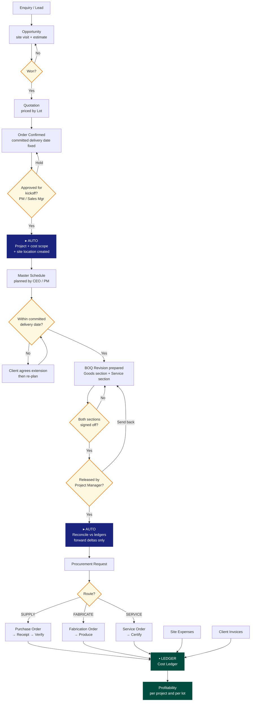
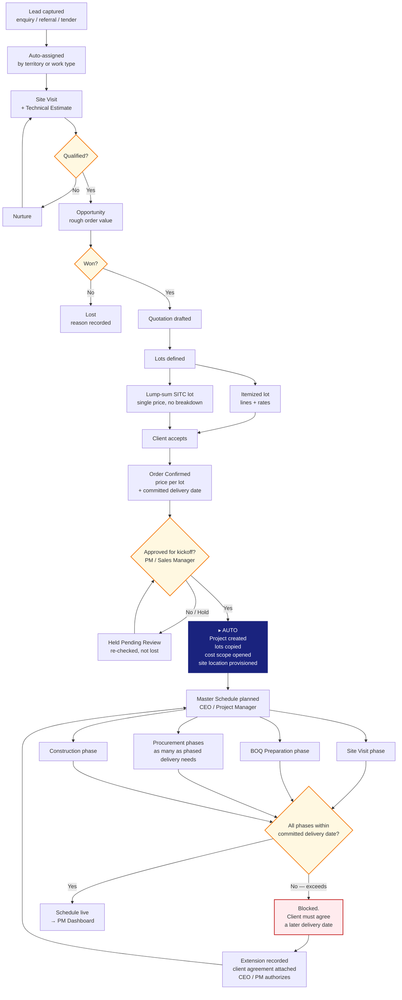
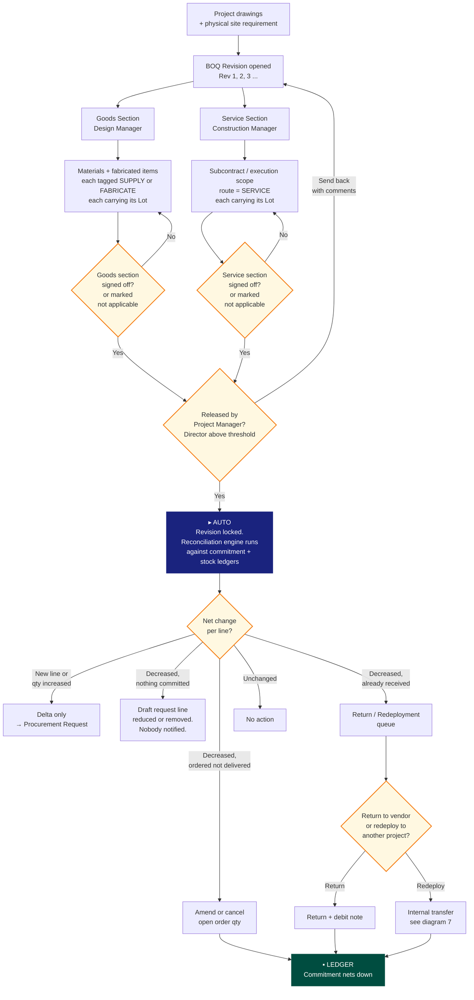
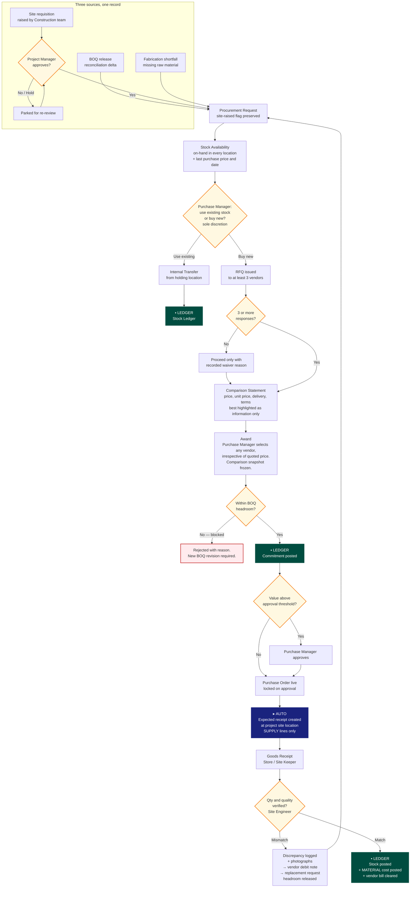
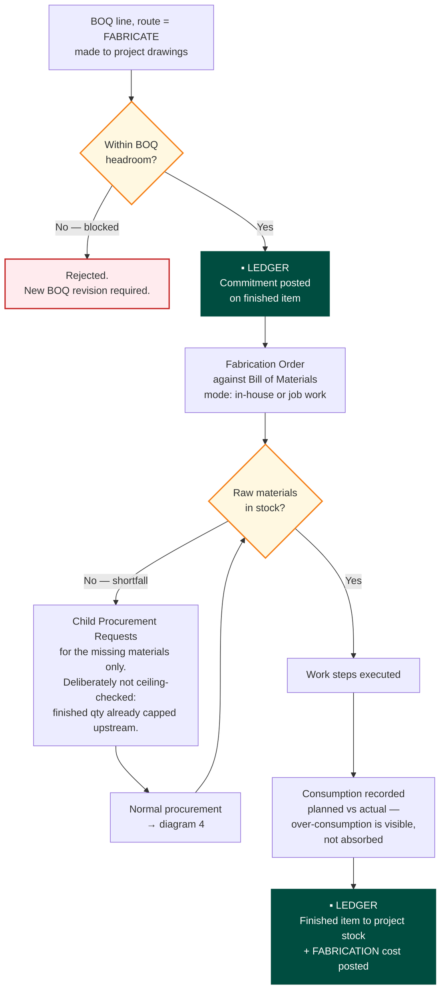
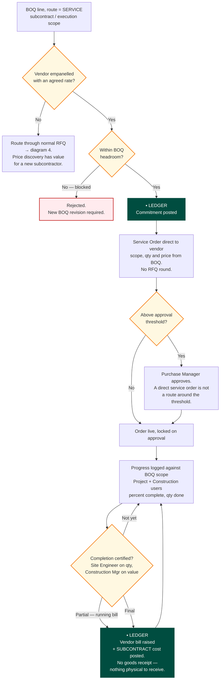
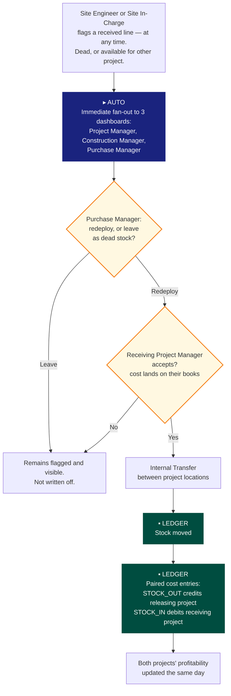
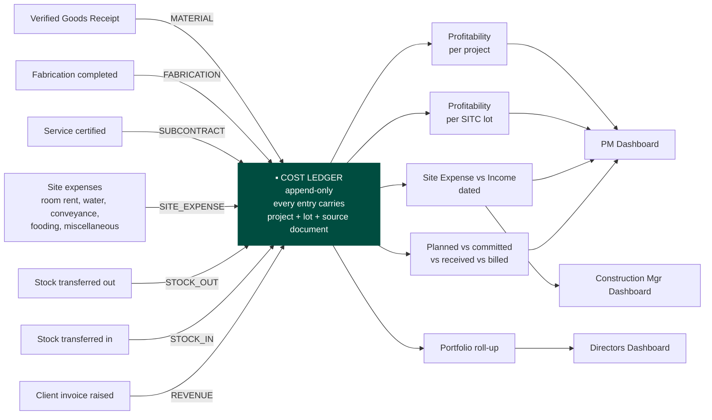

# Process Flowcharts

Companion to [`01-process-design.md`](01-process-design.md). Rendered natively by GitHub.

**Deliberately split into eight focused diagrams rather than one.** Rev. 17's single flowchart spanned three pages at a scale where the box text was unreadable, and its own document had to add a note pointing to a separate zoomable HTML file. A diagram nobody can read is not documentation. Each diagram below fits on one screen and was render-checked at readable scale.

**Legend, consistent across all six:**

| Style | Meaning |
|---|---|
| Rectangle | Process step |
| Diamond | Decision or approval gate — a named person signs off |
| `▸ AUTO` | Automatic hand-off, no re-typing (a durable event, process §5.3) |
| `▪ LEDGER` | Posts to a ledger — the authority for cost, commitment or stock |

---

## 1. End to End

---

## 2. Enquiry to Project Initiation

**Note the one-way boundary.** The order fixes what the client pays and when they get it. Neither figure is ever changed by anything downstream — only a formal change order through Sales moves them.

---

## 3. BOQ Preparation, Release & Reconciliation

**Two things this diagram fixes from rev. 17.** An empty section is marked *not applicable* and releases normally, so a materials-only or labour-only project cannot deadlock waiting on a signature. And reconciliation reads the **ledgers**, not the previous revision's text — so it stays correct when a revision lands while orders are already in flight, which on a live project is the normal case.

---

## 4. Procurement & Material Receipt

**Nothing enters a project's cost on an unverified delivery.** Verification is a separate act by a separate role from receipt — that is why they are two records, not two checkboxes on one.

---

## 5. FABRICATE Route

Downstream costing never needs to know whether an item was bought or built — both post to the same ledger against the same BOQ line.

---

## 6. SERVICE Route

Progressive billing is the loop from certification back to progress logging: a subcontractor bills each certified stage, and each stage posts independently.

---

## 7. Dead & Excess Stock Redeployment

**This is the one deliberate breach of project isolation** — which is exactly why it posts explicit paired cost entries rather than moving stock with no cost consequence. Note that flagged stock is never written off: relabelling it as usable elsewhere is the opposite of scrapping it.

---

## 8. Everything Converges on the Cost Ledger

**There is no path by which real project spend avoids the profitability figure.** Site running costs post to the same ledger as material and subcontract cost — which is the structural fix for the gap rev. 17 documented in its §6.14, where an entire category of genuine spend could not reach the profitability panel at all and needed a separate report to see.

The Site Expense vs Income view on the Construction Manager's screen and on the Project Manager's dashboard is **one query with two viewers**. The numbers cannot disagree, because there is only one set of them.
